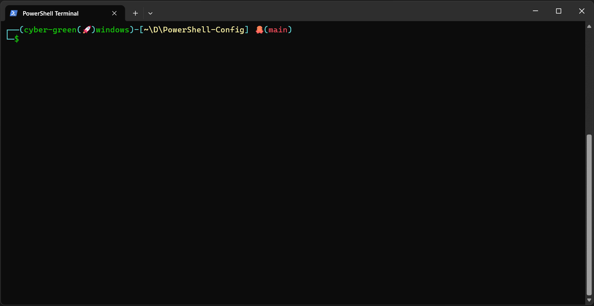
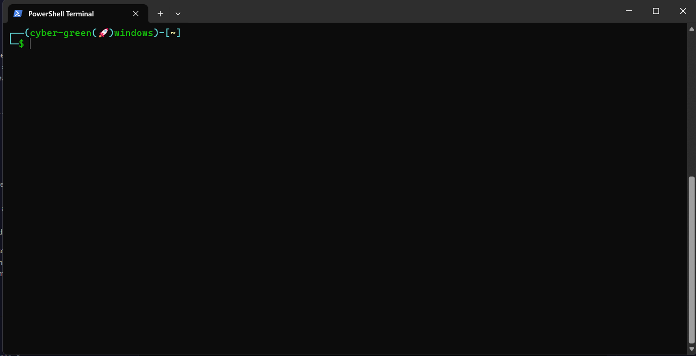

# PowerShell Custom Configuration

This is my personalized PowerShell configuration with a custom prompt and useful features.

## Features

- **Custom Prompt**: Shows username, computer, and current directory in a stylish format
- **Home Directory Alias**: Shows home directory as ~ instead of the full path
- **Compact Path Display**: Shows paths like ~\D\L\project instead of C:\Users\username\Documents\Learning\project
- **Git Integration**: Shows the current git branch with an octopus emoji 🐙
- **Color-Coded Elements**: Makes terminal output more readable
- **Status Indicator**: Shows whether the previous command succeeded (username $) or failed (red x)
- **SSH Agent**: Automatically starts SSH agent when PowerShell starts

## Installation

1. **Backup your existing profile** (if you have one):
   `powershell
   Copy-Item -Path C:\Users\your-username\OneDrive\Documents\WindowsPowerShell\Microsoft.PowerShell_profile.ps1 -Destination "C:\Users\your-username\OneDrive\Documents\WindowsPowerShell\Microsoft.PowerShell_profile.ps1.backup" -Force
   `

2. **Copy the new profile**:
   `powershell
   Copy-Item -Path "Microsoft.PowerShell_profile.ps1" -Destination C:\Users\your-username\OneDrive\Documents\WindowsPowerShell\Microsoft.PowerShell_profile.ps1 -Force
   `

3. **Restart PowerShell** to see the changes.

## Requirements

- Windows PowerShell 5.1+ or PowerShell Core 7+
- Git installed and accessible from PowerShell (for git branch display)

## Customization

You can edit the profile file to customize:
- Colors by changing the -ForegroundColor parameters
- Emojis (current: 🚀 for the prompt, 🐙 for git)
- Add additional functionality as needed

## Troubleshooting

If you encounter any issues:
- Make sure you have execution policy set to allow scripts:
  `powershell
  Set-ExecutionPolicy -Scope CurrentUser RemoteSigned
  `
- If git branch display doesn't work, ensure git is installed and in your PATH
